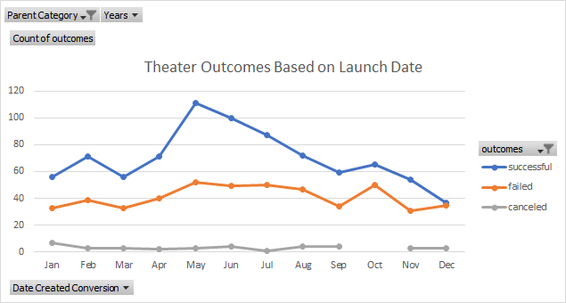
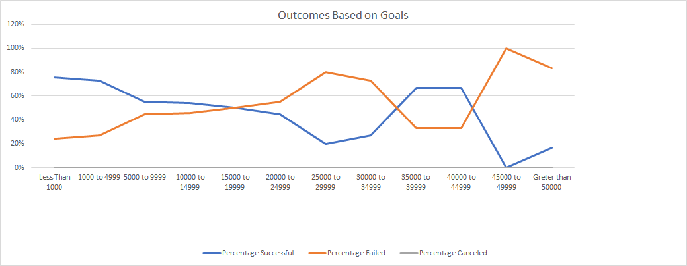

# Kickstarter Analysis
## Purpose: Analyze how different kicksatrt campaigns fared in relation to launch date and funding goals. 

## Analysis 1: Outcomes based on launch date.
### Description of Analysis 1:
#### 
Using the Kickstarter dataset:
1. I created a pivot table and filtered the table based on 
parent category: Theater. 
2. I then combined all campaign creation dates by year and displayed the combined data by month. 
3. I isolated the outcomes data and filtered to show only successful, failed, or canceled campaigns. 

## Analysis 2: Outcomes based on goals. 
### Description of Analysis 2:
####
Using Kickstarter dataset:
1. I created a new worksheet to capture percentage of successful, failed, and canceled campaignes by goal range.
2. Filtered the data to pull only outcome results for sub category: plays

## Results:
### Analysis 1: The analysis of outcomes based on launch date reveals the following:
1. The month's of May, June, July appear to be the best time to launch a campaign. The produced both the most campiagns launched and the highest number of successful campaigns.
2. The Month of Decmeber apears to be the least favorable month to launch a campaign. It produced both the least amount of campaigns with abbout 50% of these campaigns failing. 
[Analysis data](kicstarter_challenge.xlsx)

### Analysis 2: THe analysis of outcomes based on goals reveals the following:
1. Campaigns with a goal of $15,000.00 or less had a success rate greater than 50%
[Analysis data](kicstarter_challenge.xlsx)

### A more in depth analysis of the kicksatrter data would provide a more accurate analysis. For example: Identifying outliers or adding additional data to our analysis, such as pledged amounts and number of backers, may tell a more complete story. 
